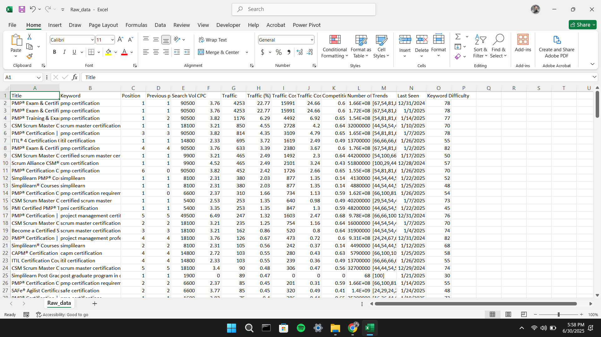
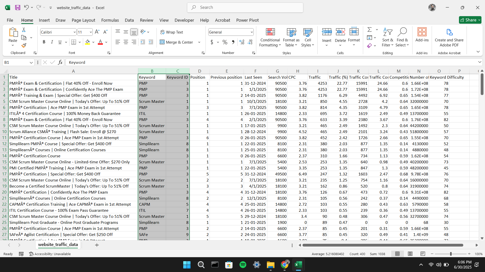
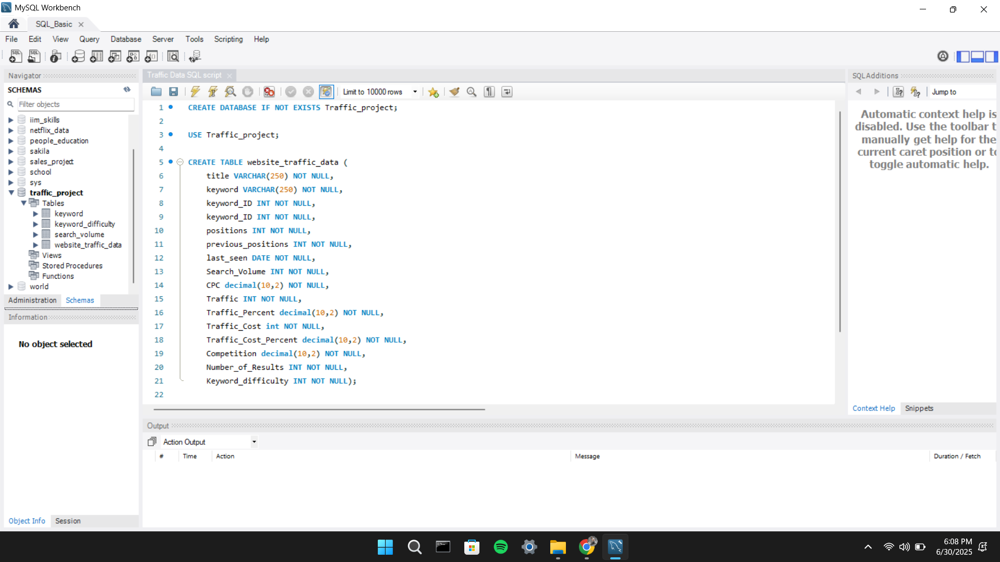
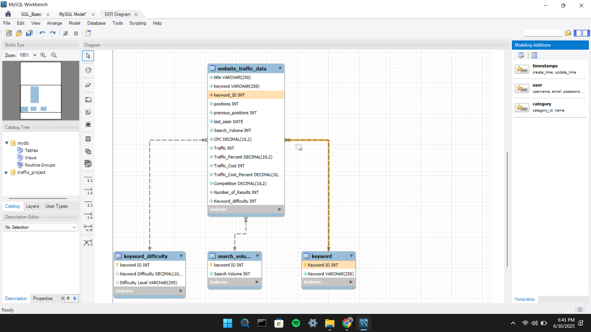
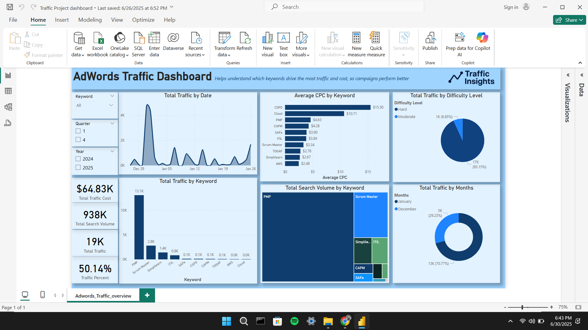

# Adword-Data-Analysis

[](https://www.python.org/)
[](https://www.mysql.com/)
[](https://www.microsoft.com/en-us/power-platform/products/power-bi)
[](https://github.com/AdityakumarDA/Adword-Data-Analysis/tree/main?tab=MIT-1-ov-file)

A complete, real-world AdWords Data Analysis pipeline from raw Excel to fully interactive dashboards using **Excel**, **Python (pandas)**, **MySQL**, and **Power BI**.

This project mimics an enterprise-level ETL (Extract, Transform, Load) and BI (Business Intelligence) solution, showcasing data cleaning, relational modeling, and dashboarding — ideal for both recruiters and students studying data analytics, BI, or SQL-based solutions.

---

## 📘 Table of Contents

- [🎯 Project Objective](#-project-objective)
- [📌 Business Objective](#-business-objective)
- [📊 Tools & Technologies](#-tools--technologies)
- [🔁 End-to-End Workflow](#-end-to-end-workflow)
- [🧹 Excel + Python Processing](#-excel--python-processing)
- [🗂 Lookup & Fact Tables Description](#-lookup--fact-tables-description)
- [🗃 SQL Schema & Relationships](#-sql-schema--relationships)
- [🧠 Relationship Diagram (EER)](#-relationship-diagram-eer)
- [📈 Power BI Dashboard](#-power-bi-dashboard)
- [🧩 Power BI Data Model View](#-power-bi-data-model-view)
- [⚙ How to Use This Project](#-how-to-use-this-project)
- [📂 Repository Structure](#-repository-structure)
- [📝 License](#-license)
- [📬 About Me](#-about-me)

---

## 🎯 Project Objective

This project analyzes Google AdWords traffic data with the goal of uncovering performance trends, keyword effectiveness, and cost dynamics. It simulates a **real-life advertising analytics pipeline**, commonly used in marketing and digital performance teams.

---

## 📌 Business Objective

To help marketing teams and decision-makers:
- Monitor campaign performance
- Identify high-performing and low-performing keywords
- Track search demand and cost trends over time
- Visualize performance KPIs via intuitive dashboards

---

## 📊 Tools & Technologies

| Tool        | Purpose                                             |
|-------------|-----------------------------------------------------|
| Excel       | Initial data entry, manual formulas, CSV exports    |
| Python      | DataFrame manipulation, ID generation, CSV output   |
| MySQL       | Relational schema modeling & querying               |
| Power BI    | Data modeling, DAX metrics, visual analytics        |

---

## 🔁 End-to-End Workflow


Each stage builds on the last. The result is a smooth, production-style pipeline from messy input to insights.

---

## 🧹 Excel + Python Processing

### ✅ Step 1: Raw Data (Raw_data.xlsx)
- Contains columns like `title`, `keyword`, `positions`, `traffic`, `CPC`, etc.
- This is the simulated export from Google AdWords.



### ✅ Step 2: Assigning Keyword IDs with Python
Using `pandas`, we:
- Loaded Excel using `pd.read_excel()`.
- Created unique `keyword_ID` values by mapping each keyword to a number.
- Example (conceptual):
  ```python
  df['keyword_ID'] = df['keyword'].astype('category').cat.codes
  ```

### ✅ Step 3: Splitting Clean Tables
Created three new CSVs:
- `keyword.csv`: Unique list of keywords + IDs.
- `search_volume.csv`: Total volume using `SUMIF`.
- `keyword_difficulty.csv`: Average difficulty using `AVERAGEIF`.


These were calculated using **Excel formulas**:


| Formula | Purpose |
|--------|---------|
| `SUMIF()` | Aggregate total search volume |
| `AVERAGEIF()` | Compute average difficulty |
| `IF(B2>=50,"Hard","Moderate")` | Assign difficulty label |
| `VLOOKUP()` | Lookup keyword metadata |

✅ These tables act as lookup/reference tables for SQL.


---

## 🗂 Lookup & Fact Tables Description

#### 🔹 `keyword.csv`
This table contains a deduplicated list of all unique keywords with their assigned `keyword_ID`.

| Column Name  | Description                                                  |
|--------------|--------------------------------------------------------------|
| `keyword_ID` | Unique identifier for each keyword (used as primary key)     |
| `keyword`    | Actual keyword text, fetched from raw data using `VLOOKUP`   |

✅ Created using Excel's `VLOOKUP` function to map keywords with their IDs.


---

#### 🔹 `search_volume.csv`
This table includes the total monthly search volume per keyword.

| Column Name      | Description                                                        |
|------------------|--------------------------------------------------------------------|
| `keyword_ID`     | Foreign key that links to the `keyword.csv` table                  |
| `search_volume`  | Monthly search volume, aggregated using Excel’s `SUMIF` function   |

✅ Created using `SUMIF` to calculate the total search volume for each keyword ID.


---

#### 🔹 `keyword_difficulty.csv`
This table stores the average keyword difficulty score along with a difficulty level label.

| Column Name         | Description                                                                      |
|---------------------|----------------------------------------------------------------------------------|
| `keyword_ID`         | Foreign key linking to the `keyword.csv` table                                   |
| `avg_difficulty`     | Average difficulty score, calculated using `AVERAGEIF`                           |
| `difficulty_level`   | Text label derived using Excel's `IF` function (e.g., `"Hard"` if ≥ 50)          |

✅ Created using:
- `AVERAGEIF` to compute average difficulty per `keyword_ID`
- `IF` to categorize as `"Hard"` or `"Moderate"`


---

#### 🔸 `website_traffic_data.csv` (Main Fact Table)
This table holds all enriched AdWords metrics after processing.

| Column Name             | Description                                               |
|--------------------------|-----------------------------------------------------------|
| `title`                 | Campaign or landing page title                             |
| `keyword`               | Keyword string (linked via `keyword_ID`)                   |
| `keyword_ID`            | Foreign key from `keyword.csv`, created using Python       |
| `positions`             | Current average ad position                                |
| `previous_positions`    | Previous average position                                  |
| `last_seen`             | Last recorded impression/click date                        |
| `search_volume`         | Total monthly searches                                     |
| `CPC`                   | Cost-per-click (USD)                                       |
| `Traffic`               | Estimated traffic from the keyword                         |
| `Traffic_Percent`       | Percentage of total traffic                                |
| `Traffic_Cost`          | Cost attributed to keyword traffic                         |
| `Traffic_Cost_Percent`  | Percentage of total traffic cost                           |
| `Competition`           | Keyword competition score (0–1 scale)                      |
| `Number_of_Results`     | Total search engine results for the keyword                |
| `Keyword_difficulty`    | Foreign key from `keyword_difficulty.csv`                  |

✅ This is the central **fact table**, joined with all three lookup tables to support relational queries and visualizations.





---

## 🗃 SQL Schema & Relationships

Created a MySQL database:  
```sql
CREATE DATABASE IF NOT EXISTS Traffic_project;
USE Traffic_project;
```

### 🔧 Main Table: `website_traffic_data`
This is the fact table containing AdWords metrics.

```sql
CREATE TABLE website_traffic_data (
    title VARCHAR(250) NOT NULL,
    keyword VARCHAR(250) NOT NULL,
    keyword_ID INT NOT NULL,
    positions INT NOT NULL,
    previous_positions INT NOT NULL,
    last_seen DATE NOT NULL,
    Search_Volume INT NOT NULL,
    CPC decimal(10,2) NOT NULL,
    Traffic INT NOT NULL,
    Traffic_Percent decimal(10,2) NOT NULL,
    Traffic_Cost int NOT NULL,
    Traffic_Cost_Percent decimal(10,2) NOT NULL,
    Competition decimal(10,2) NOT NULL,
    Number_of_Results INT NOT NULL,
    Keyword_difficulty INT NOT NULL
);
```


### 📘 Schema Screenshot




### 🔑 Keys & Normalization

Imported the other CSVs into MySQL:
- `keyword`
- `search_volume`
- `keyword_difficulty`

Then established relational integrity:
```sql
ALTER TABLE website_traffic_data
ADD FOREIGN KEY (keyword_ID) REFERENCES keyword(keyword_ID);
```

These keys ensure consistent data joins between tables.

---

## 🧠 Relationship Diagram (EER)



These diagrams visualize the 1-to-many relationships between:
- Keywords → Traffic Data
- Keyword Difficulty → Traffic Data
- Search Volume → Traffic Data

---

## 📈 Power BI Dashboard

Connected Power BI to MySQL database and created an interactive dashboard.

### 📌 Visual Elements
- **Cards**: Total Traffic, Search Volume, Cost, Results
- **Line Chart**: Traffic over time
- **Bar Chart**: Traffic by Keyword
- **Treemap**: Search Volume by Keyword
- **Pie/Donut**: Traffic by Difficulty, by Month
- **Slicers**: Year, Quarter, Keyword filter



### 🔢 DAX Measures
```DAX
Average CPC = AVERAGE(website_traffic_data[CPC])
Last Date = MAX('website_traffic_data'[last_seen])
Start Date = MIN('website_traffic_data'[last_seen])
Total Results = SUM(website_traffic_data[Number_of_Results])
Total Search Volume = SUM(website_traffic_data[Search_Volume])
Total Traffic = SUM('website_traffic_data'[Traffic])
Total Traffic Cost = SUM(website_traffic_data[Traffic_Cost])
Traffic Percent = AVERAGE(website_traffic_data[Traffic_Percent])

Calender = CALENDAR([Start Date],[Last Date])
Months = FORMAT(Calender[Date],"MMMM")
Quarter = QUARTER(Calender[Date])
Year = YEAR(Calender[Date])
Year and QTR = 'Calender'[Year] & " QTR " & 'Calender'[Quarter]
```

These enable filtering, aggregation, and time-based visualizations.

---

## 🧩 Power BI Data Model View

To enable seamless slicing and aggregation, a clean star schema was created in Power BI.

### Relationships:
- Fact: `website_traffic_data`
- Dimensions:
  - `keyword` (via keyword_ID)
  - `keyword_difficulty`
  - `search_volume`

✅ This model ensures accurate filtering and joins.


---

## ⚙ How to Use This Project

### 🔹 1. Clone the Repo
```bash
git clone https://github.com/AdityakumarDA/Adword-Data-Analysis.git
```

### 🔹 2. Open Excel Files
- View and understand `Raw_data.xlsx`, CSVs
- Optionally edit and export again using Excel formulas

### 🔹 3. Set Up MySQL
- Import all `.csv` using MySQL Workbench
- Use provided SQL schema to create and relate tables

### 🔹 4. Open Power BI Dashboard
- Use `Traffic Project dashboard.pbix` to view interactive report
- Or connect manually via: `Home → Get Data → MySQL`

---

## 📂 Repository Structure

```
📦 Adword-Data-Analysis
 ┣ 📄 Raw_data.xlsx
 ┣ 📄 website_traffic_data.csv
 ┣ 📄 keyword.csv
 ┣ 📄 keyword_difficulty.csv
 ┣ 📄 search_volume.csv
 ┣ 📄 Traffic Data SQL script.sql
 ┣ 📄 Traffic Project dashboard.pbix
 ┣ 📁 images
 ┃ ┣ 📷 raw_excel_sample.png
 ┃ ┣ 📷 excel_lookup_table_1.png
 ┃ ┣ 📷 excel_lookup_tables_2png
 ┃ ┣ 📷 excel_lookup_table_3.png
 ┃ ┣ 📷 main_table.png
 ┃ ┣ 📷 mysql_schema_editor.png
 ┃ ┣ 📷 EER_Diagram.png
 ┃ ┣ 📷 power_bi_dashboard.png
 ┃ ┗ 📷 powerbi_data_model.png
 ┣ 📄 LICENSE
 ┗ 📄 README.md
```

---

## 📝 License

This project is licensed under the **MIT License** — you are free to use, modify, and share with attribution.

---

## 📬 About Me

I'm **Aditya Rajput**, a data analyst passionate about storytelling with data, unsupervised learning, and real-world analytics.

- [LinkedIn](https://www.linkedin.com/in/adityakumarda/)  
- [GitHub](https://github.com/AdityakumarDA)  
- [Tableau Public](https://public.tableau.com/app/profile/adityakumarda)

If you liked this project, please ⭐ the repo!

---

> 📌 _If you're a recruiter: This demonstrates strong knowledge in data pipelines, transformation, relational modeling, and BI reporting._  
> 📌 _If you're a student: Feel free to use this structure to learn data integration and dashboarding step by step._
